# 1. CÀI ĐẶT ELK 

[Tham khảo.](https://www.linuxtechi.com/how-to-install-elk-stack-on-ubuntu/)

```
sudo systemctl status elasticsearch
sudo systemctl status kibana
sudo systemctl status logstash
sudo systemctl status filebeat
```

## 1.1 CÀI VMTOOLS

```
sudo apt update
sudo apt install -y open-vm-tools open-vm-tools-desktop
sudo reboot
```

Kiểm tra lại:

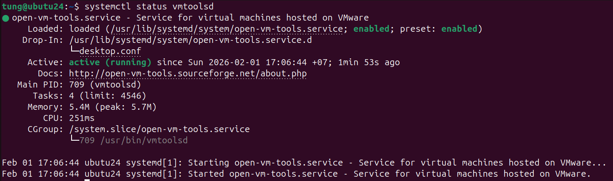

Đặt địa chỉ mạng fix cứng:


## 1.2. CÀI ELK

### 1.2.1. CÀI ĐẶT JAVA

Cập nhật lại hệ thống:

```
sudo apt update
sudo apt upgrade -y
```

Cài `OpenJDK 17`:

```
sudo apt install openjdk-17-jdk -y
java -version
```

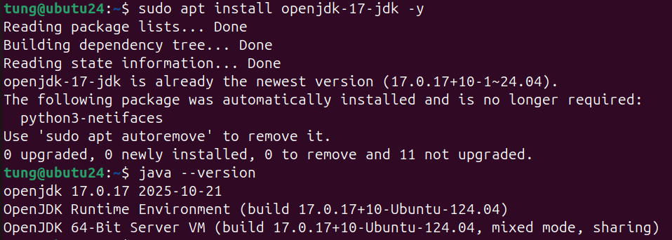

### 1.2.2. THÊM KHO LƯU TRỮ ELASTIC STACK

Thêm Khóa GPG:

```
sudo wget https://artifacts.elastic.co/GPG-KEY-elasticsearch -O /etc/apt/keyrings/GPG-KEY-elasticsearch.key
```

Thêm Elasticsearch Repository:

```
echo "deb [signed-by=/etc/apt/keyrings/GPG-KEY-elasticsearch.key] https://artifacts.elastic.co/packages/8.x/apt stable main" | sudo tee /etc/apt/sources.list.d/elastic-8.x.list
sudo apt update
```

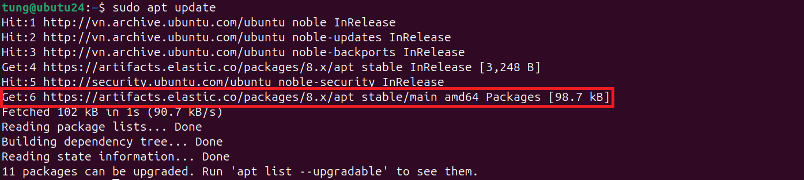

### 1.2.3. CÀI ĐẶT ELASTICSEARCH

```
sudo apt install elasticsearch -y
```

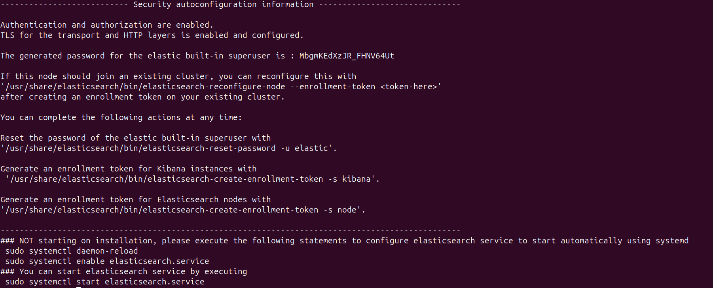

```
sudo systemctl daemon-reload
sudo systemctl start elasticsearch
sudo systemctl enable elasticsearch
sudo systemctl status elasticsearch
```

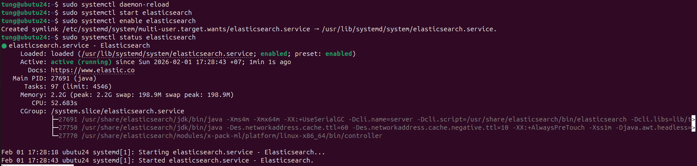

### 1.2.4. CẤU HÌNH ELASTICSEARCH

Truy cập vào tệp cấu hình ElasticSearch:

```
sudo nano /etc/elasticsearch/elasticsearch.yml
```

Tìm dòng xóa chú thích và đổi tên lại thành sau:

```
cluster.name: sample-cluster
node.name: elasticsearch-node
```

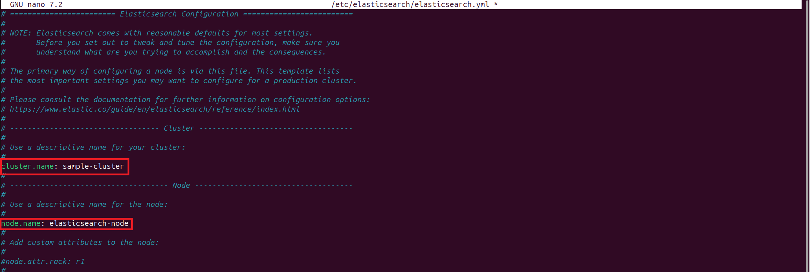

Elasticsearch chỉ có thể truy cập được trên localhost. Để cho phép truy cập từ bên ngoài, hãy bỏ dấu chú thích và cập nhật thuộc tính `network.host` thành `0.0.0.0`.


Tiếp theo, tìm chỉ thị `xpack.security.enabled:` và đặt nó thành false.

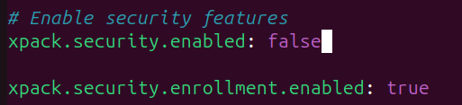

Lưu các thay đổi và thoát khỏi tệp cấu hình. Để áp dụng các thay đổi, hãy khởi động lại Elasticsearch.

```
sudo systemctl restart elasticsearch
```

Để kiểm tra xem dịch vụ Elasticsearch có đang chạy hay không, hãy gửi yêu cầu HTTP bằng tiện ích Curl như hình minh họa.

```
curl -X GET "localhost:9200"
```

Sẽ nhận được phản hồi với một số thông tin cơ bản về nút cục bộ của mình:

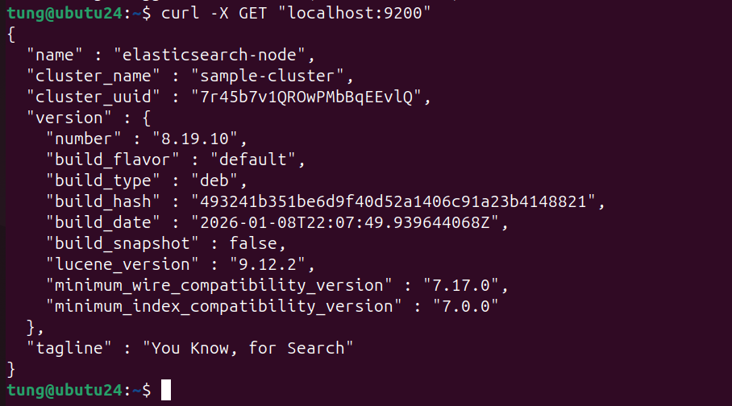

Ngoài ra, cũng có thể thực hiện việc này từ trình duyệt web `http://server_ip:9200`.

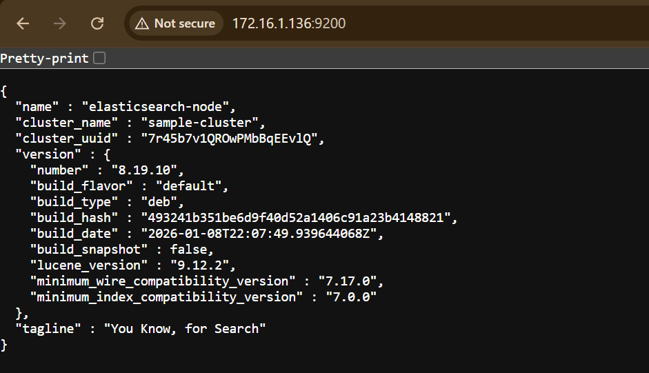

### 1.2.5. CÀI ĐẶT KIBANA

Cài Kibana:

```
sudo apt install kibana -y

sudo systemctl start kibana

sudo systemctl enable kibana

sudo systemctl status kibana
```

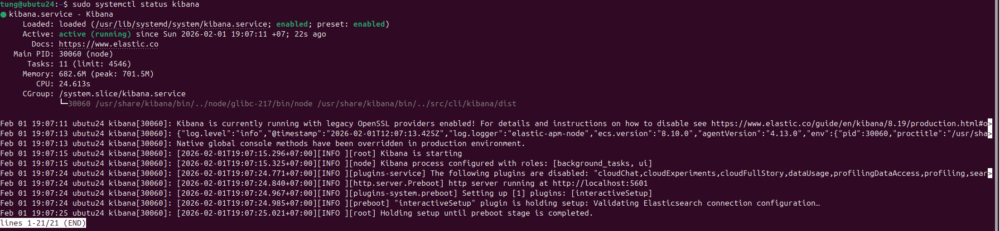

Theo mặc định, Kibana lắng nghe trên cổng TCP 5601. Có thể xác nhận điều này bằng cách chạy lệnh:

```
sudo ss -pnltu | grep 5601
```

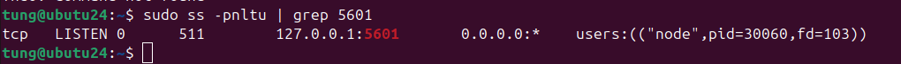

### 1.2.6. CẤU HÌNH KIBANA

Truy cập vào tệp cấu hình:

```
sudo nano /etc/kibana/kibana.yml
```

Bỏ dấu tích khỏi những dòng sau và thực hiện lưu file:

```
server.port: 5601
server.host: 0.0.0.0
elasticsearch.hosts: ["http://localhost:9200"]
```

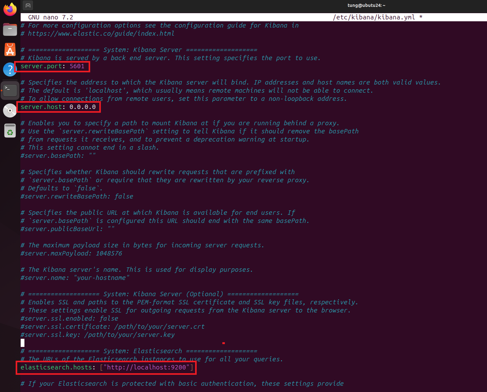

Thực hiện lưu và khởi động lại Kibana:

```
sudo systemctl daemon-reload
sudo systemctl restart kibana
sudo systemctl status kibana --no-pager
```

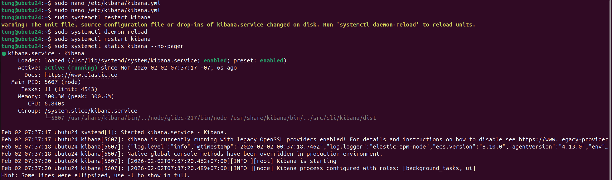

Truy cập Kibana từ trình duyệt Web `http://server-ip:5601`.

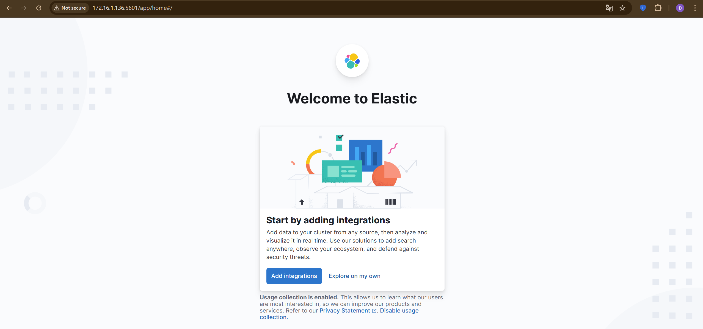

Ngoài ra, có thể xem tổng quan về trạng thái và các dịch vụ hiện có bằng cách truy cập URL sau `http://server-ip:5601/status`.

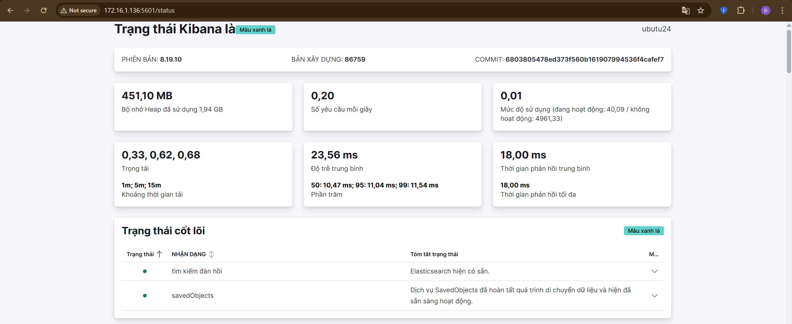

### 1.2.7. CÀI ĐẶT LOGSTASH

```
sudo apt install logstash -y
sudo systemctl start logstash
sudo systemctl enable logstash
sudo systemctl status logstash
```

### 1.2.8. CẤU HÌNH LOGSTASH

```
sudo nano /etc/logstash/conf.d/02-beats-input.conf
```

Nội dung trong file conf:

```
input {
  beats {
    port => 5044
  }
}
```

Cấu hình file có tên là `30-elasticsearch-output.conf`:

```
sudo nano /etc/logstash/conf.d/30-elasticsearch-output.conf
```

Nội dung:

```
output {
  if [@metadata][pipeline] {
     elasticsearch {
     hosts => ["localhost:9200"]
     manage_template => false
     index => "%{[@metadata][beat]}-%{[@metadata][version]}-%{+YYYY.MM.dd}"
     pipeline => "%{[@metadata][pipeline]}"
     }
  } else {
     elasticsearch {
     hosts => ["localhost:9200"]
     manage_template => false
     index => "%{[@metadata][beat]}-%{[@metadata][version]}-%{+YYYY.MM.dd}"
     }
  }
}
```

Lưu và thoát. Để kiểm tra cấu hình Logstash, hãy chạy lệnh:

```
sudo -u logstash /usr/share/logstash/bin/logstash --path.settings /etc/logstash -t
```

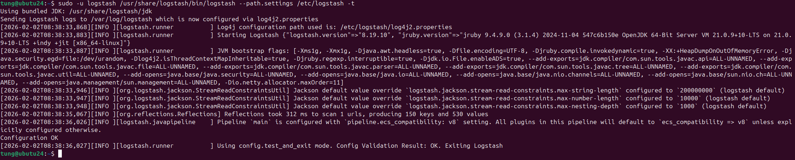

Kết quả đầu ra bao gồm một khối các dòng mã với chuỗi –  Kết quả xác thực cấu hình: OK. Thoát khỏi Logstash – được hiển thị ở cuối. Nếu không thấy điều này trong kết quả đầu ra, hãy chắc chắn kiểm tra lại cấu hình Logstash để tìm lỗi.

Để các thay đổi có hiệu lực, khởi động lại Logstash.

```
sudo systemctl restart logstash
```

### 1.2.9. CẤU HÌNH FILEBEAT

```
sudo apt install filebeat -y
```

Tiếp theo, sẽ cấu hình Filebeat để gửi dữ liệu đến Logstash. Vì vậy, hãy truy cập vào tệp cấu hình Filebeat:

```
sudo nano /etc/filebeat/filebeat.yml
```

Cấu hình Filebeat để gửi dữ liệu trực tiếp đến Logstash để xử lý thay vì Elasticsearch. Do đó, cần vô hiệu hóa đầu ra của Elasticsearch. Để thực hiện điều này, hãy tìm phần `output.elasticsearch` và bỏ chú thích các dòng sau:

```
#output.elasticsearch:
  # Array of hosts to connect to.
  #hosts: ["localhost:9200"]
```

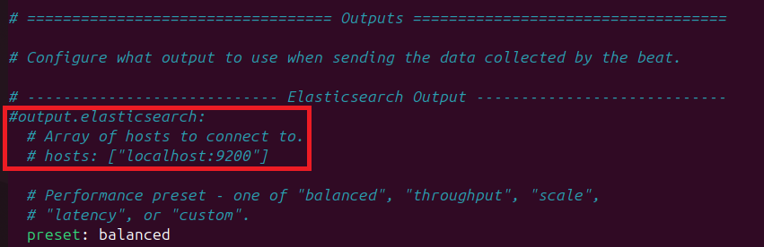

Tiếp theo, sẽ cấu hình Filebeat để kết nối với Logstash trên máy chủ Elastic Stack tại cổng 5044. Để làm điều này, hãy bỏ dấu chú thích ở các dòng `output.logstash:` và `hosts: ["localhost:5044"] `.

```
output.logstash:
  # The Logstash hosts
  hosts: ["localhost:5044"]
```

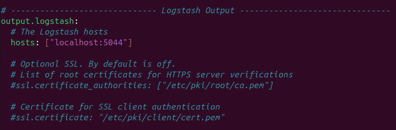

Sau khi hoàn tất, hãy lưu các thay đổi và thoát.

Các mô-đun Filebeat mở rộng chức năng của Filebeat. Ở đây, sẽ kích hoạt mô-đun hệ thống thu thập và phân tích nhật ký được tạo ra bởi dịch vụ ghi nhật ký của hệ thống.

Để xem danh sách tất cả các mô-đun có sẵn, hãy chạy lệnh:

```
sudo filebeat modules list
```


Để kích hoạt mô-đun hệ thống, hãy chạy lệnh:

```
sudo filebeat modules enable system
```

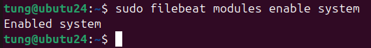

Tiếp theo, bạn cần cấu hình các pipeline thu thập dữ liệu của Filebeat. Các pipeline này sẽ phân tích dữ liệu nhật ký trước khi chuyển tiếp qua Logstash đến Elasticsearch. Chạy lệnh sau để tải pipeline thu thập dữ liệu cho module hệ thống.

```
sudo filebeat setup --pipelines --modules system
```


Tiếp theo, cần tải mẫu chỉ mục vào Elasticsearch. Chỉ mục đơn giản là một tập hợp các tài liệu có đặc điểm tương tự. Để tải mẫu, hãy chạy lệnh:

```
sudo filebeat setup --index-management -E output.logstash.enabled=false -E 'output.elasticsearch.hosts=["localhost:9200"]'
```

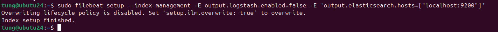

Theo mặc định, Filebeat cung cấp các mẫu bảng điều khiển Kibana để trực quan hóa dữ liệu Filebeat trong Kibana. Do đó, trước khi sử dụng các bảng điều khiển này, điều bắt buộc là phải tạo mẫu chỉ mục trước và tải các bảng điều khiển vào Kibana.

Để làm vậy, hãy chạy lệnh sau:

```
sudo filebeat setup -E output.logstash.enabled=false -E output.elasticsearch.hosts=['localhost:9200'] -E setup.kibana.host=localhost:5601
```

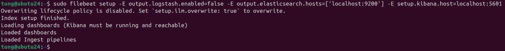

Từ đây, hãy khởi động và kích hoạt Filebeat.

```
sudo systemctl start filebeat 
sudo systemctl enable filebeat
sudo systemctl status filebeat
```

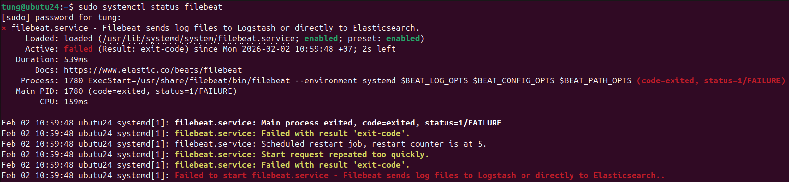

Ảnh như trên thì tức là chúng ta cần fix lỗi, ban đầu ta sẽ kiểm tra:

```
sudo journalctl -u filebeat -n 200 --no-pager
```

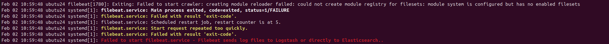

`module system is configured but has no enabled filesets` tức là đã enable module system, nhưng trong cấu hình module system lại không bật fileset nào (fileset phổ biến là syslog và auth). Vì vậy Filebeat không biết phải thu thập log gì → nó thoát (exit 1).

Mở cấu hình module system:

```
sudo nano /etc/filebeat/modules.d/system.yml
```

Thay đổi như sau:

```
- module: system
  #syslog:
  #  enabled: true
  #auth:
  #  enabled: true
```

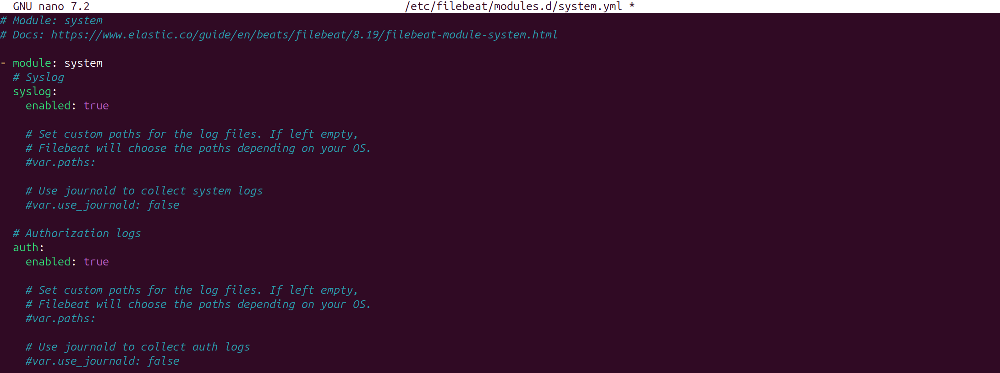

Test config rồi restart:

```
sudo filebeat test config -e
sudo systemctl reset-failed filebeat
sudo systemctl restart filebeat
sudo systemctl status filebeat --no-pager
```

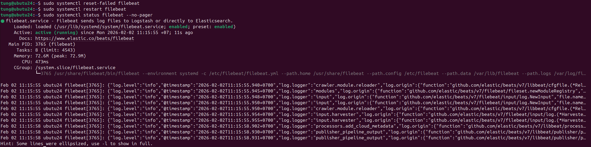

Đã cài thành công.


